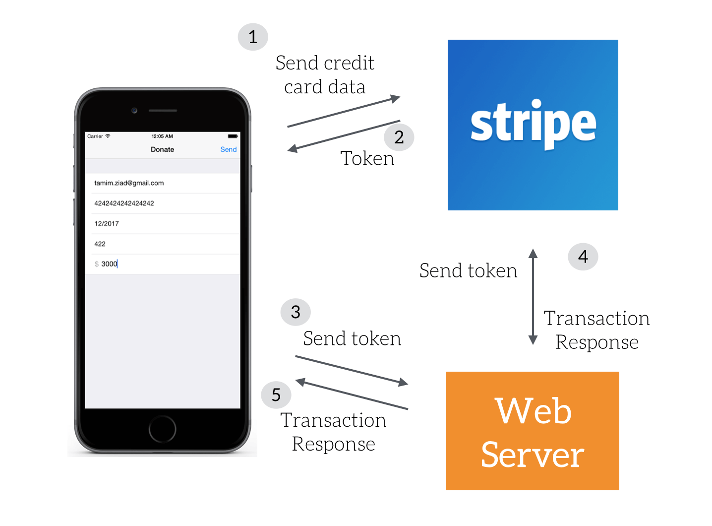

# Paywalls

Eventually you gotta get paid...

And there enters paywalls or "payment services" like [Stripe](stripe.com) and [Braintree](braintreepayments.com).

Why do we use a service? Why not role our own?

The answer to this is we use services to make sure our data is [PCI Compliant](http://www.onlinetech.com/resources/references/what-is-pci-compliance) - the set of standards and regulations for the secure storage and usage of credit card information. In order to be PCI compliant on your own you'd have to do a lot of extra work. So instead of doing this in house, we use payment services or payment processors.

## Competencies & Objectives

1. Describe and design the simplest possible checkout workflow.
1. Describe the complexities of designing a market place like Uber or Airbnb.
1. Implement a simple checkout workflow using Stripe or Braintree.

## Background

## Resources

1. [Stripe](stripe.com)
1. [Braintree](braintreepayments.com).

## Baseline challenges

1. Write a user narrative and draw a wireframe of how users will purchase pets in Famous Amos' Pet Emporium. (10 min)
1. Pick between Braintree and Stripe. First outline the pros and cons, limitations and affordances - compare and contrast these two services with a partner. (10 min)
1. With your partner, make a step-by-step plan and draw a picture of how the client will communicate with your payment provider service and your server. What information will be stored on your server? In which attribute of which model? The transaction? The customer? (10 min)
1. Implement the client of your checkout process by dropping in the "drop in UI" options that both Stripe and Braintree offer. (10 min)
1. Submit your token/nonce to the server and console log it at a POST endpoint at the path `/pets/:id/purchase`. (10 min).
1. Get your keys and make them available in the context of your app using your `.env` file
1. Use the Node.JS SDK documentation of either Stripe or Braintree to process the transaction using the token/nonce you are getting from the client. Verify that the payment went through on your Stripe and Braintree dashboard.
1. With your partner come up with a list of things that could go wrong with payments. What is a worst case scenario? What are common hiccups or problems or features of payments? Make a plan for how a user would deal with each of these problems.
